# Shopify Fall 2021 Intern Challenge

## Purpose
This image repository was built for the Shopify Fall 2021 Intern Challenge. It currently has one common repository, but users will be implemented to allow each user to have their own list of images and decide which pictures to make available for others to see.
## Features
* All images in the repository can be viewed and deleted
* New images can be added to the repository with custom tags and a custom name. Additional tags are added automatically when adding an image to the repository
* An image's name and it's tags can be edited
* The image repository can be queried using a list of tags or an image
## Demo
* A list of images in the repository can be viewed by clicking on the 'My images' tab in the navigation bar:
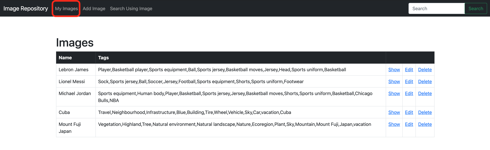

* To add an image to the repository, click the 'Add Image' in the navigation bar. Then, fill out the form and click the 'Create Image' button:
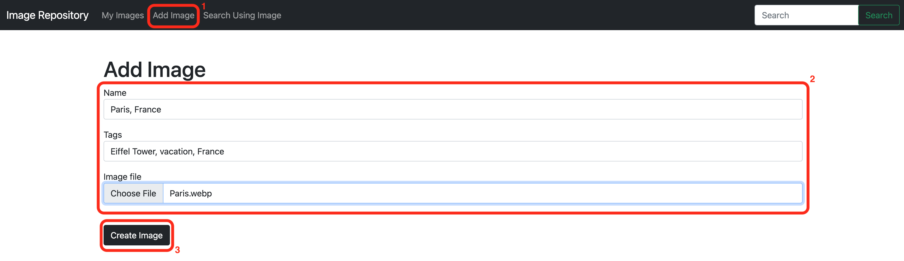

    The following page will be displayed, confirming that the image has been added to the repository:
    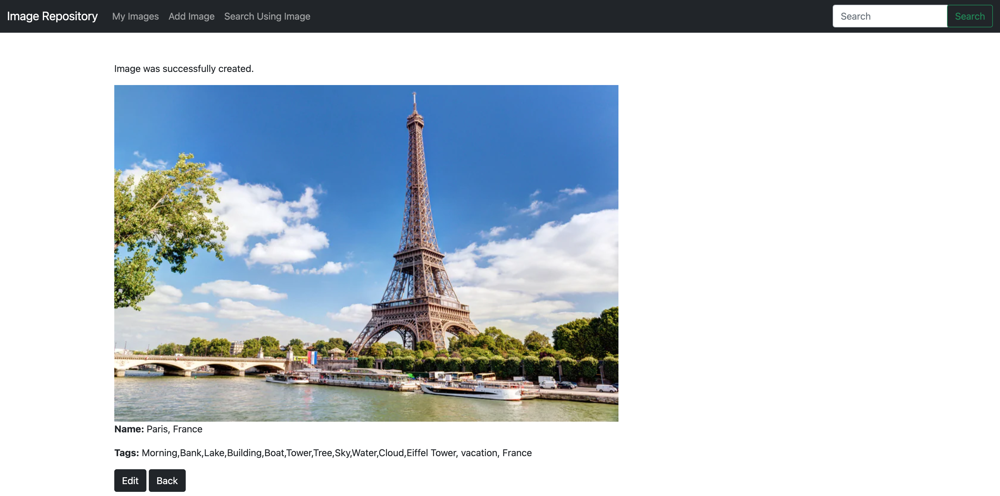
    

* To view an image, its name and its tags, click 'show' from the 'My Images' tab:
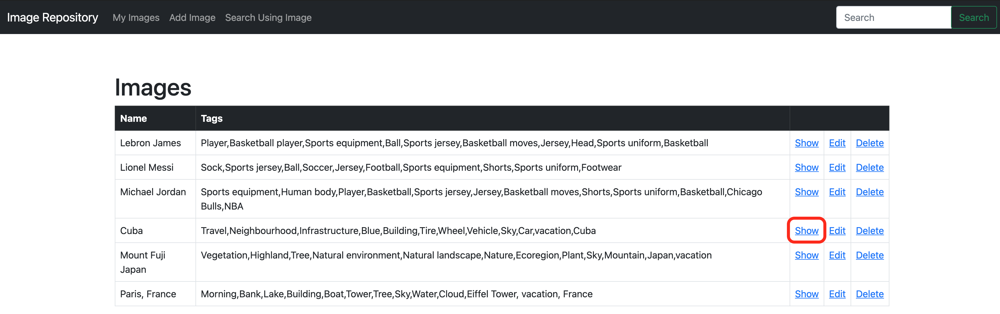
    
    The following page will be displayed:
    

* To edit an image, click 'edit' from the 'My Images' tab:
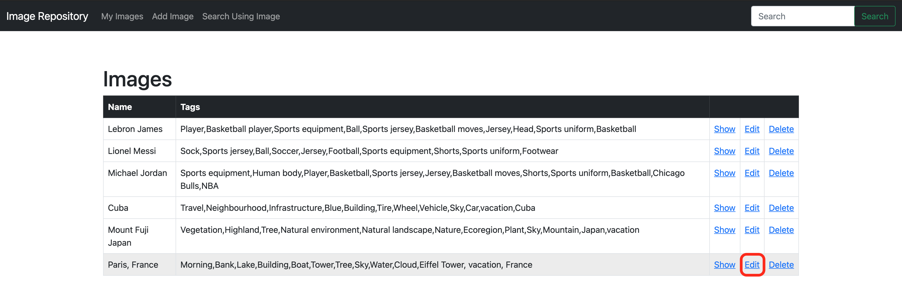
Then, make the desired changes and click the 'Update Image' button:
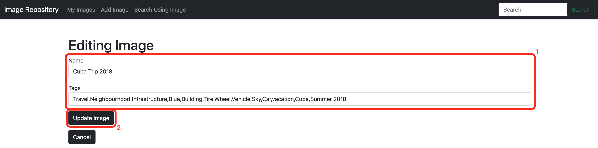

A page similar to the one seen after adding an image to the repository will be displayed, confirming that the image has been updated.

* To delete an image from the repository, click 'Delete' from the 'My Images' tab:
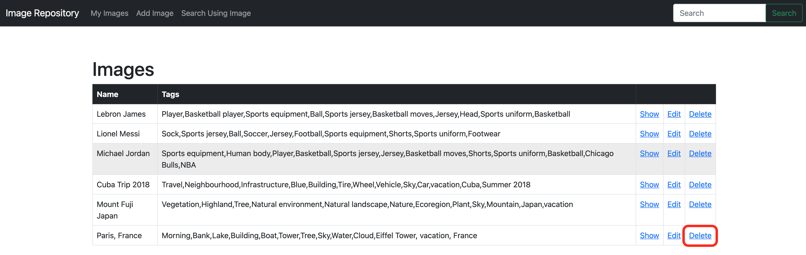

* To query the repository using tags, type any number of tags, separated by a comma, in the search bar to the right of the navigation bar and click the 'Search' button:
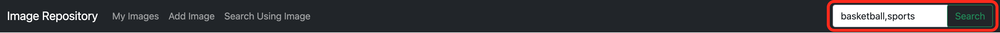

    A list of all images that have at least one of the entered tags in their tags will be displayed:
    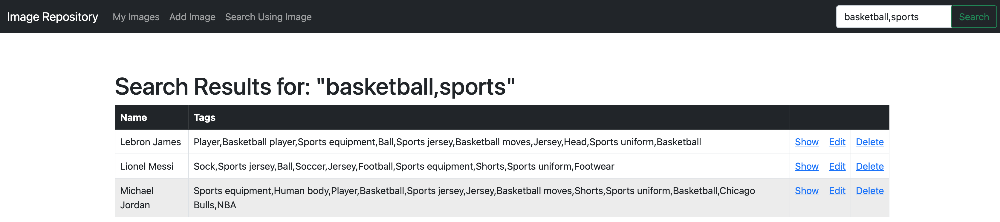

* To query the repository using an image, click the 'Search Using Image' tab in the navigation bar and upload an image:
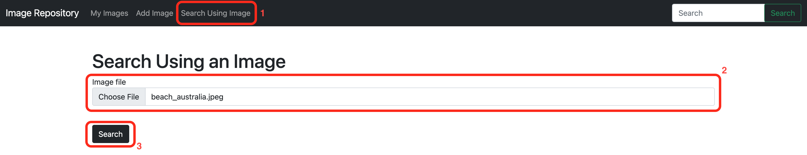
    A list of all images that have at least one tag in common with the entered image's automatically generated tags will be displayed:
    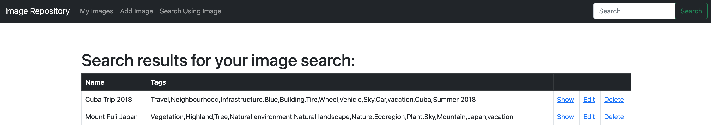

## Technology used
* Ruby on Rails
* Google Vision AI
## How to run the application
* Get an API token for Google Vision AI
* Set an environment variabl GOOGLE_API_KEY to the token
* Run the command 'rails s'
* Navigate to http://localhost:3000